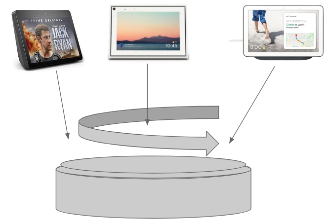
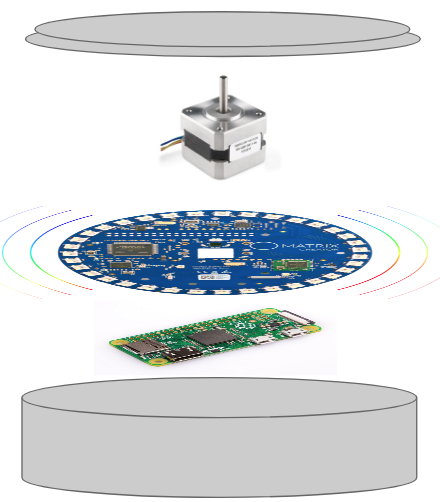

# Product Name

## What is ____

This is a product for rotating a smart device according to the direction of sound. The smart devices released these days is supposed to serve us by listening and showing things without physical interaction. But in reality, we need to readjust the direction of this device. So we create ___ which rotates smart devices' direction automatically.

# Application

## Requirements

### Hardware Requirements

- Matrix Voice
- Raspberry Pi 4 Model B
- MicroSD 32GB
- SD Card Reader
- Servo Motor

### Build Requirements

- ODAS (**O**pen embedde**D** **A**udition **S**ystem)
- Node js
- ZeroMQ
- JavaScript
- Python version
- Matrixio-kernel-modules
- matrix-Hal
- Matrix-Lite
- Matrix-Core

## Software Architecture

### Servo Motor Control

- Matrix Hal or Matrix Lite

### Voice Localization

- ODAS

### Voice Recognition

- 미정

## Installation

- [Raspberry Pi installation]()
- [Matrix Voice installation]()
- [Odas installation]()

