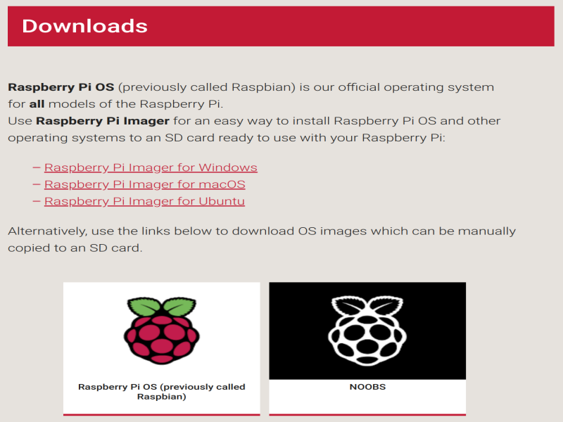
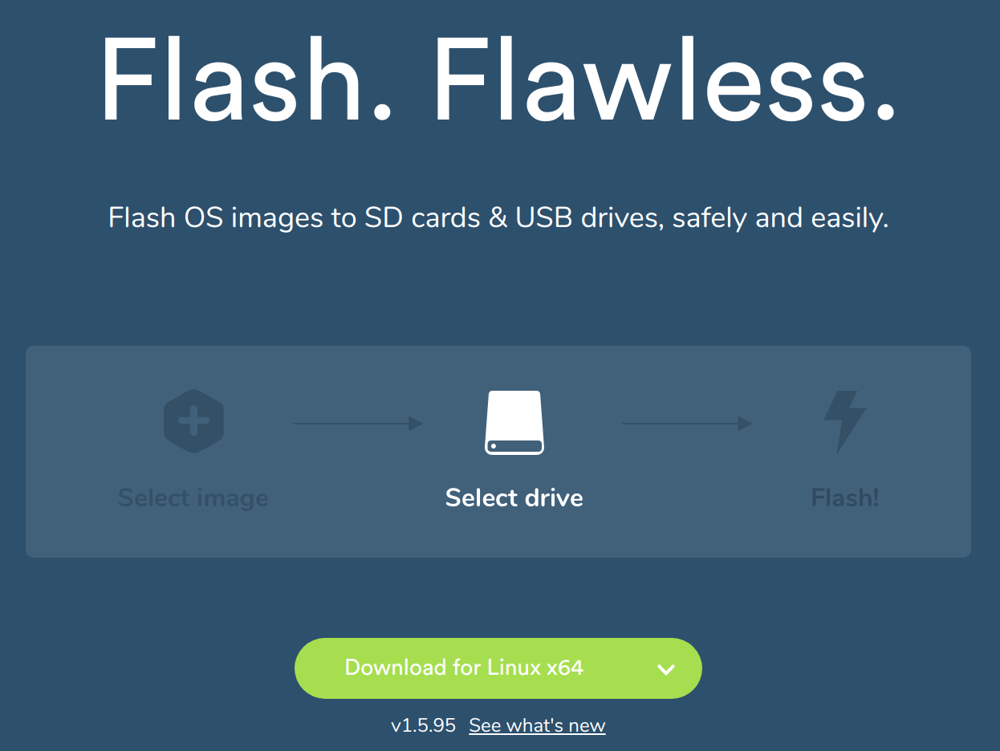
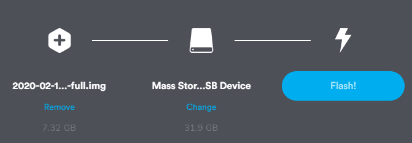
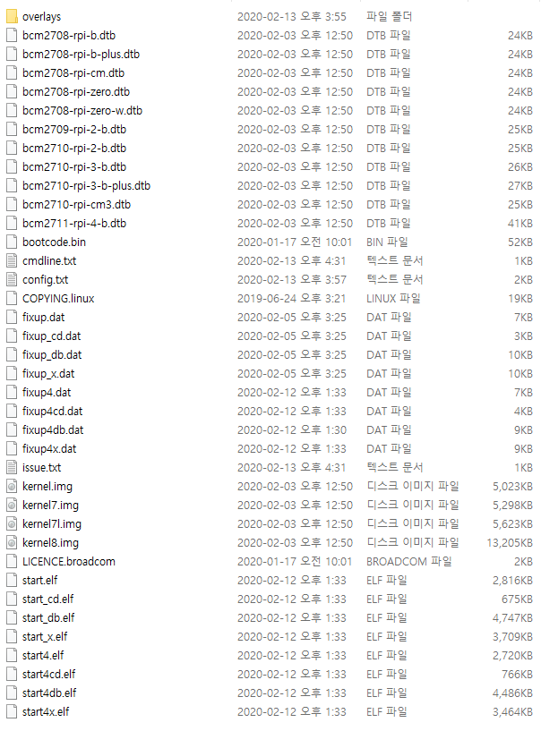
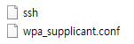
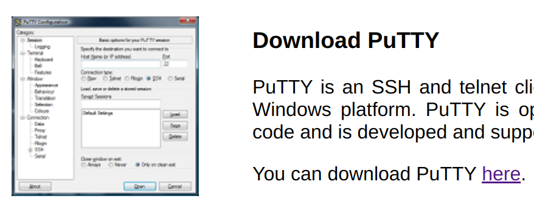
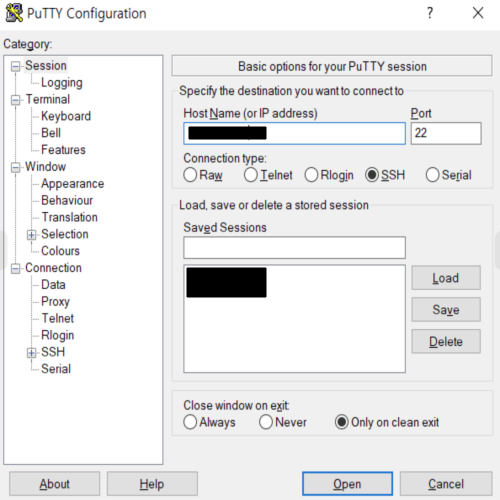
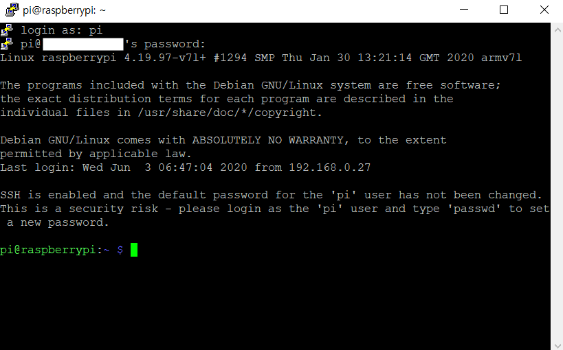

# Raspberry Pi Installation

Raspberry Pi 4에 모니터없이 Raspbian을 설치하고 SSH로 접속하는 방법

*이 Guide는 Window10 기준으로 쓰여졌습니다.*


### Required

- Micro SD card(32GB)
- Micro SD reader
- Raspberry Pi 4B
- Laptop
- LAN cable

### Link

- [Raspberry Pi homepage](https://www.raspberrypi.org/downloads/)
- [Balena homepage](https://www.balena.io/etcher/)
- [Putty homepage](https://putty.org/)


## Install Raspbian

<p align="center"></p>

[Raspberry Pi homepage](https://www.raspberrypi.org/downloads/)

Raspberry Pi OS 그림을 클릭한 후, 3가지의 Rasp다bian중에 원하는 것을 다운받는다.

- GUI 지원
  - Raspberry Pi OS (32-bit) with deskto다p and recommended software
  - Raspberry Pi OS (32-bit) with desktop
- GUI 미지원
  - Raspberry Pi OS (32-bit) Lite


## Install Balena Etcher

<p align="center"></p>

[Balena homepage](https://www.balena.io/etcher/)

다운로드한 Raspbian 이미지 파일을 SD card에 설치하기 위해 운영체제에 맞는 Etcher 프로그램을 다운로드 한다.


<p align="center"></p>

좌측에 다운받은 zip 파일, 중간에는 MicroSD card를 선택한다음 Flash 버튼을 누른다. 

Flash가 완료되면 boot 드라이브가 만들어지고 다음과 같은 파일들이 설치되어있다.


<p align="center"></p>

첫 부팅과 동시에 Wifi에 접속하고, ssh 연결이 가능하도록 하기위해서 2가지 파일을 작성해서 넣어주어야 한다.

- wpa_supplicant.conf
- ssh

```conf
//wpa_supplicant.conf
//Wifi 해당국가를 명시해줘야한다.
country=KR
ctrl_interface=DIR=/var/run/wpa_supplicant GROUP=netdev
update_config=1
network={
    ssid="Wifi Name"
    psk="Wifi Password"
}
```

ssh는 이름이 ssh인 빈 파일로 만든다. (확장자 주의)

<p align="center"></p>

위의 두 파일을 boot drive에 넣고, MicroSD card를 Raspberry Pi에 연결한 후 전원을 넣어준다. 그런 다음 해당 와이파이 공유기의 공유기 설정 홈페이지에서 Raspberry Pi가 어떤 ip를 받았는지 확인하면 된다.


iptime의 경우 192.168.0.1로 접속 후, 

[로그인 - 관리도구 - 고급설정 - 네트워크 관리 - 내부네트워크 설정] 에서 확인할 수 있다.


## Install Putty

부여받은 ip를 확인한 후에 ssh를 사용하여 접속하기 위해서는 Putty라는 프로그램을 설치해야한다. (윈도우일 경우에만 설치하고, Linux 환경에서는 ssh만 설치하면 된다.)

<p align="center"></p>

[Putty homepage](https://putty.org/)

홈페이지에서 here를 클릭하면 나오는 다운로드 페이지에서 운영체제에 맞게 다운로드하고 설치하면 된다. 


<p align="center"></p>

설치가 완료되면 Putty를 실행하고, Host Name에 아까 공유기 설정 홈페이지에서 확인한 Raspberry Pi에 할당된 ip를 입력하여 접속한다.

SSH가 연결되면 login을 한다.

- ID: pi
- Password: raspberry

위 아이디와 패스워드를 입력한다. (Default)

<p align="center"></p>

다음과 같은 창이 뜨면 성공
